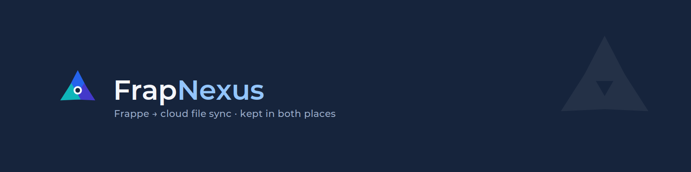

<div align="center">
  
</div>

<h1 align="center">FrapNexus</h1>

<p align="center">
  <b>Sync your Frappe file attachments to SharePoint &amp; Google Drive — and keep them in Frappe.</b>
</p>

<p align="center">
  <a href="#features">Features</a> ·
  <a href="#how-it-works">How it works</a> ·
  <a href="#installation">Installation</a> ·
  <a href="#setup--configuration">Setup</a> ·
  <a href="#usage">Usage</a> ·
  <a href="#guide">Guide</a>
</p>

---

## Overview

FrapNexus extends Frappe's built-in file handling so that whenever a file is attached to a
record, it can be transparently uploaded to **SharePoint** or **Google Drive** in addition to —
or instead of — Frappe's local storage. You decide, per DocType, *where* files live and *how*
their cloud folder structure is named.

It works by overriding Frappe's core `File` document class, so it applies to **every** attachment
field across your site without touching your other apps.

## Features

- **🔌 Multiple providers** — Connect SharePoint (via Azure AD app) and Google Drive (via service
  account) side by side.
- **📂 Per-DocType rules** — Choose `Frappe only`, `Cloud only`, or `Both` for each DocType.
- **🧭 Templated folder paths** — Build cloud folders from static text, field values, the record
  name, or the DocType name — with a live path preview in the form.
- **🏷️ Flexible file naming** — Keep original filenames or apply a template like `{name}-{field}`.
- **⚔️ Conflict handling** — Rename, replace, or fail on duplicate filenames.
- **🔐 Cached credentials** — Tokens are cached with expiry so connections stay fast.
- **🧭 FrapNexus workspace** — Installed on the desk home with shortcuts to every doctype and the
  guide; visible to **System Manager** by default.
- **🎨 Modern, branded forms** — Every FrapNexus form ships with a clean, on-brand UI and inline
  guidance.

## How it works

```
 Attach a file ──▶ Frappe File (overridden) ──▶ FN Upload Rule for the DocType?
                                                  │
                          ┌───────────────────────┼───────────────────────┐
                          ▼                        ▼                       ▼
                    Frappe only               Cloud only                 Both
                  (stock behaviour)      (push to cloud, file_url    (disk write +
                                          points at the cloud)        cloud mirror)
```

The cloud destination and folder path come from the **FN Upload Rule** matched to the attachment's
target DocType, resolved against the linked **FN Cloud Connection**.

## Installation

Install with the [bench](https://github.com/frappe/bench) CLI:

```bash
cd $PATH_TO_YOUR_BENCH

# get the app
bench get-app frapnexus $URL_OF_THIS_REPO --branch main/develop

# install onto a site
bench --site $SITE_NAME install-app frapnexus

# build the bundled assets (logo, branded form styles)
bench build --app frapnexus
bench --site $SITE_NAME clear-cache
```

Then reload your browser. A **FrapNexus** workspace is added to the desk home (visible to System
Managers) with shortcuts to all DocTypes and the setup guide.

### Roles & access

- **System Manager** can create and manage FN Cloud Connections and FN Upload Rules (folder
  structure) — this is the default role for all FrapNexus DocTypes.
- **Any user** can attach files: connection lookup, rule matching and folder creation run
  server-side in the background, so no extra permissions (or exposure of credentials) are needed.

**Requirements**

- Frappe v14+
- Python 3.10+
- Python packages `google-api-python-client` and `google-auth` (installed automatically)

## Setup & configuration

### 1. Create a FN Cloud Connection

Go to **FN Cloud Connection → New**.

**SharePoint**
1. Register an app in Azure AD and grant it `Sites.ReadWrite.All`.
2. Enter the **Tenant ID**, **Client ID**, and **Client Secret**.
3. Enter the **Site Name** (the part after `/sites/` in the SharePoint URL) and the
   **Drive Name** (document library).

**Google Drive**
1. Create a service account in Google Cloud and download its JSON key.
2. Share the destination Drive folder with the service account's email.
3. Attach the JSON key file and set the **Root Folder ID**.

Click **Connect** — a green *Connected* pill confirms the credentials work.

### 2. Create an FN Upload Rule

Go to **FN Upload Rule → New**.

| Field | What it does |
| --- | --- |
| **Target Doctype** | Which DocType's attachments this rule governs |
| **Storage Mode** | `Frappe only` / `Cloud only` / `Both` |
| **FN Cloud Connection** | The connection to upload through |
| **Naming Strategy** | `Original` filename or a `Templated` name (`{name}`, `{field}`) |
| **Conflict Behavior** | `Rename`, `Replace`, or `Fail` on duplicates |
| **Folder Segments** | One row per folder level — watch the live path preview update |

### 3. Test it

Use the bundled **FN Test Upload** DocType (or any DocType you wrote a rule for), attach a file, and
confirm it appears in the target SharePoint/Drive folder.

## Usage

Once a rule is in place, **no further action is needed** — staff attach files the normal Frappe
way and FrapNexus routes them according to your rules. Cloud-only files have their `file_url`
pointed at the cloud copy, so links keep working from inside Frappe.

## Guide

A full, illustrated setup-and-usage guide is bundled with the app and served at:

```
https://your-site/frapnexus-guide
```

## Contributing

This app uses `pre-commit` for code formatting and linting. Please
[install pre-commit](https://pre-commit.com/#installation) and enable it:

```bash
cd apps/frapnexus
pre-commit install
```

Configured tools: `ruff`, `eslint`, `prettier`, `pyupgrade`.

## License

[MIT](license.txt) · © Octo Advisory
